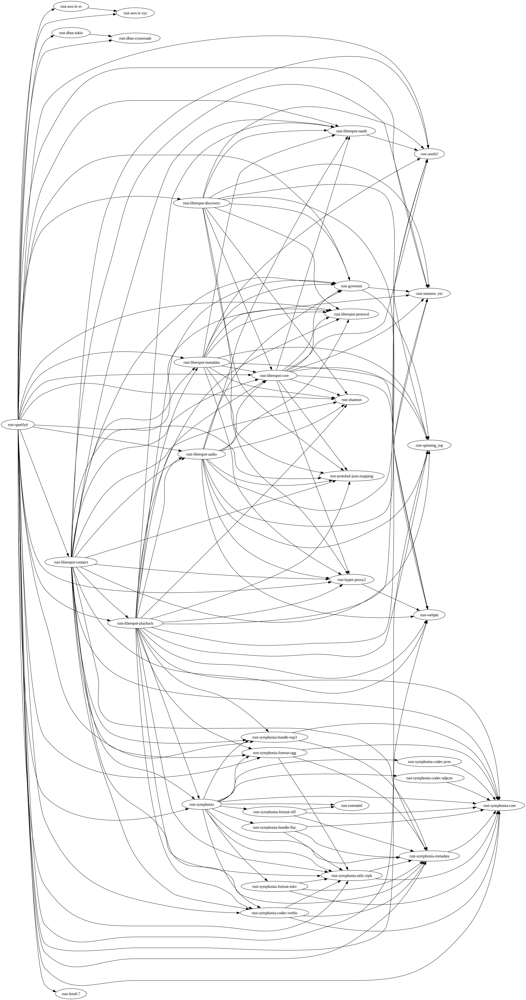

# Maintenance Hints

## Packaging Guidelines

Full packaging guidelines for Fedora may be found here: https://docs.fedoraproject.org/en-US/packaging-guidelines/

## Rust2rpm

Use the `rust2rpm` tool to create/update rust packages:

```
$ sudo dnf install rust2rpm
$ rust2rpm --store-crate --no-rpmautospec --ignore-missing-license-files <crate_name>@<version>
```

Annoyingly RPM autospec macros were not working in COPR, but passing `--no-rpmautospec` to rust2rpm does not prevent it from erasing previous manual changelog entries, so some fettling is required.

## Build Order

General build order for bootstrapping a new root is shown in the dependency graph generated by the `package_tree.sh` script:


